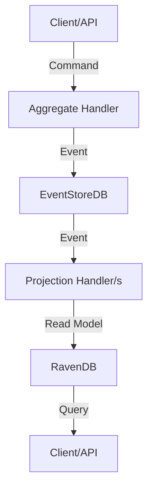

# 🚀 Rosetta Framework

**Domain-Driven Design, Event Sourcing, and Projections for .NET & F# — with RavenDB/MongoDB, EventStoreDB, and modern HostBuilder integration.**


---

## ✨ Overview

**Rosetta** is a powerful, opinionated framework for building robust, Event-Sourced, Domain-Driven Microservices in .NET

Levarage the power of **F# Discriminated Unions** inside Rosetta to create error-proof Domain Solutions!

It provides:

- 🧩 **Aggregate Roots** and **Domain Events** (DDD)
- ⚡ **Event Sourcing** with EventStoreDB
- 📊 **Projections** from EventStoreDB with persistence using RavenDB and MongoDB (NoSQL)
- 📊 **Custom (Cross-Aggregate) Projection Definitions**
- 🏗️ **HostBuilder Extensions** for seamless DI and service registration
- 🛠️ **CQRS**-friendly patterns and handler abstractions
- 🧪 **TestKit** for BDD Testing

---

## 📝 Note:

 - While **Rosetta** is opinionated in its choice of technologies, it is built to be easily extensible.
 - You can integrate any Event Sourcing Store and SQL/NoSQL database implementation with minimal effort, adapting the framework to your unique requirements and infrastructure.
 - Any additional implementations are very welcome and would contribute to the Framework's out-of-the-box usability!

```fsharp
//Implementing the db for Aggregates (either to save the entire AggregateState all at once or to save the produced Events for Event Sourcing purposes)
type IAggregateRepository =
    abstract member StoreAsync: aggregate: IAggregate -> Task
    abstract member GetAsync<'TAggregate, 'TEvents
            when 'TAggregate : (new : unit -> 'TAggregate) 
            and 'TAggregate :> IAggregate
            and 'TAggregate : not struct
            and 'TEvents :> IAggregateEvents> : 
        id: string * [<Optional; DefaultParameterValue(Int64.MaxValue)>] version: int64 -> Task<Option<'TAggregate>>

//Implementing the db for Projections
type ICheckpointStore =
    abstract member ReadAsync: id: string -> Task<Checkpoint> 
    abstract member StoreAsync: checkpoint: Checkpoint -> Task

type IProjectionsStore =
    abstract member StoreAsync<'T when 'T : not struct> : doc: 'T -> Task
    abstract member StoreInUnitOfWorkAsync<'T when 'T : not struct> : docs: 'T[] -> Task
    abstract member LoadAsync<'T when 'T : not struct> : id: obj -> Task<'T>
    abstract member LoadManyAsync<'T when 'T : not struct> : ids: obj[] -> Task<Dictionary<obj, 'T>>
    abstract member DeleteAsync<'T when 'T : not struct>: id: obj -> Task
    abstract member DeleteInUnitOfWorkAsync<'T when 'T : not struct>: ids: obj[] -> Task
```

## 📦 Features

- **Aggregate & Event Abstractions**: Write expressive, testable domain logic.
- **EventStoreDB Integration**: Reliable, scalable event storage.
- **RavenDB/MongoDB Projections**: Fast, flexible read models.
- **Plug-and-Play HostBuilder Extensions**: Register everything with a single line.
- **CQRS Handlers**: Command and event handler patterns out-of-the-box.
- **Idempotency & Consistency**: Built-in support for safe, repeatable operations.
- **Modern F# & C# Support**: Idiomatic, clean code for both languages.

---

## 🏗️ Architecture



---

## 🚦 Quick Start

### 1. Install NuGet Packages

```shell
dotnet add package SI.Rosetta.Aggregates
dotnet add package SI.Rosetta.Projections
```

### 2. Configure Infrastructure

Whether you're using Aggregates, Projections, or both - the persistence underneath needs to be properly configured.

```json
{
  "RavenDB": {
    "Urls": "your_raven_url",
    "CertificatePath": "relative/path/to/certificate.pfx",
    "CertificatePassword": "your_password",
    "DatabaseName": "your_db_name"
  },
  "EventStoreDB": {
    "ConnectionString": "esdb://localhost:2113?Tls=false"
  },
   "MongoDB": {
   "Host": "localhost",
   "Port": "27017",
   "Username": "your_username",
   "Password": "your_password",
   "AuthSource": "your_auth_source",
   "DatabaseName": "your_db_name"
   }
}
```

### 3. Register Aggregates & Projections

```fsharp
open SI.Rosetta.Aggregates.HostBuilder
open SI.Rosetta.Projections.HostBuilder

Host
  .CreateDefaultBuilder()
  .UseAggregatesWith<SI.Rosetta.HostBuilder.EventStore>(typeof<_Assembly_Containing_Aggregates_>.Assembly)
  .UseProjectionsWith<SI.Rosetta.HostBuilder.EventStore, SI.Rosetta.HostBuilder.RavenDB>(typeof<_Assembly_Containing_Projections_>.Assembly)
  .Build()
  .Run()
```

---

## 🧑‍💻 Example: Person Aggregate

### Domain Messages
```fsharp
type RegisterPerson = {
    Id: string
    Name: string
}

type ChangePersonName = {
    Id: string
    Name: string
}

type PersonRegistered = {
    Id: string
    Name: string
}

type PersonNameChanged = {
    Id: string
    Name: string
}

type PersonCommands =
    | Register of RegisterPerson
    | ChangeName of ChangePersonName
    interface IAggregateCommands // [REQUIRED]

type PersonEvents =
    | Registered of PersonRegistered
    | NameChanged of PersonNameChanged
    interface IAggregateEvents // [REQUIRED]
```

### Domain Model

```fsharp
type PersonAggregate() =
    inherit Aggregate<PersonAggregateState, PersonCommands, PersonEvents>() // <IAggregateState, IAggregateCommands, IAggregateEvents>
    override this.Execute(command: PersonCommands) =
        match command with
            | PersonCommands.Register cmd -> this.Register cmd
            | PersonCommands.ChangeName cmd -> this.ChangeName cmd

    member private this.Register(cmd: RegisterPerson) =
        let event = PersonEvents.Registered { Id = cmd.Id; Name = cmd.Name; Metadata = cmd.Metadata }
        this.PublishedEvents.Add event //OPTIONAL
        this.Apply event

    member private this.ChangeName(cmd: ChangePersonName) =
        let event = PersonEvents.NameChanged { Id = cmd.Id; Name = cmd.Name; Metadata = cmd.Metadata }
        this.PublishedEvents.Add event //OPTIONAL
        this.Apply event
```

### State

```fsharp
type PersonAggregateState() =
    inherit AggregateState<PersonEvents>() //<IAggregateEvents>
    override this.ApplyEvent(ev) =
        match ev with
        | Registered e -> 
            this.Id <- e.Id
            this.Name <- e.Name
        | NameChanged e -> 
            this.Name <- e.Name
```

### Handler

```fsharp
type PersonAggregateHandler(repo: IAggregateRepository) =
    inherit AggregateHandler<PersonAggregate, PersonCommands, PersonEvents>() // <IAggregateState, IAggregateCommands, IAggregateEvents>
    override this.ExecuteAsync(command) =
        task {
            match command with
            | Register cmd -> do! this.IdempotentlyCreateAggregate cmd.Id command
            | ChangeName cmd | SetHeight cmd -> do! this.IdempotentlyUpdateAggregate cmd.Id command
        }
```

---

## 📊 Example: Person Projection

```fsharp
[<HandlesStream(ProjectionStreamNames.PersonStream)>]
type PersonProjection() =
    inherit Projection<PersonEvents>() // <IAggregateEvents>
    interface IAmHandledBy<PersonProjectionHandler, PersonEvents> // <IProjectionHandler, IAggregateEvents>

type PersonProjectionHandler(store: INoSqlStore) =
    interface IProjectionHandler<PersonEvents> with
        member this.Handle(event, checkpoint) =
            task {
                match event with
                | Registered e -> let person = { ... }; do! store.StoreAsync person
                | NameChanged e -> do! this.Project(e.Id, fun p -> { p with Name = e.Name })
            }
```

---

## 📊 Example: Cross-Aggregate Custom Projections

```fsharp
[<CustomProjectionStream(ProjectionStreamNames.TotalPeopleStream)>]
type TotalPeopleAndOrganizationsCustomProjectionEvents = 
    | PersonRegistered of PersonRegistered
    | OrganizationRegistered of OrganizationRegistered
    interface ICustomProjectionEvents

[<HandlesStream(ProjectionStreamNames.TotalPeopleStream)>]
type TotalPeopleAndOrganizationsCustomProjection() =
    inherit Projection<TotalPeopleCustomProjectionEvents>()
    interface IAmHandledBy<TotalPeopleAndOrganizationsCustomProjectionHandler, TotalPeopleAndOrganizationsCustomProjectionEvents>

type TotalPeopleAndOrganizationsCustomProjectionHandler(store: INoSqlStore) =
    let Store = store
    
    interface IProjectionHandler<TotalPeopleAndOrganizationsCustomProjectionEvents> with
        member this.Handle(event: TotalPeopleAndOrganizationsCustomProjectionEvents, checkpoint: uint64) =
            task {
                match event with
                | TotalPeopleCustomProjectionEvents.PersonRegistered _ ->
                    do! this.Project(fun custom ->
                        { custom with
                            TotalPersons = custom.TotalPersons + 1 }).ConfigureAwait(false)
                | TotalPeopleCustomProjectionEvents.OrganizationRegistered _ ->
                    do! this.Project(fun custom ->
                        { custom with
                            TotalOrganizations = custom.TotalOrganizations + 1 }).ConfigureAwait(false)
```

---


## 🏆 Why Rosetta?

- **DDD-first**: Designed for rich, expressive Domain Models.
- **Event Sourcing**: Every state change is an Event, not just a row update.
- **Projections**: Build fast, query-optimized Read Models.
- **Extensible**: Add your own Aggregates, (Custom) Projections, and Stores.
- **Modern .NET**: Async/await, DI, HostBuilder, and more.

---

## 🛡️ Best Practices

- Use **CQRS**: Separate command and query responsibilities.
- Keep **Domain logic** in Aggregates, not Handlers or Controllers.
- Register all services via HostBuilder extensions.
- Write minimal-code **Unit Tests** for Aggregates and Projections using **Aggregate Test Kit** and **Projections Test Kit**

---

## 📚 Documentation

- [Event Sourcing Concepts](https://martinfowler.com/eaaDev/EventSourcing.html)
- [Domain-Driven Design](https://dddcommunity.org/)
- [RavenDB Docs](https://ravendb.net/docs/)
- [MongoDB Docs](https://www.mongodb.com/docs/)
- [EventStoreDB Docs](https://developers.eventstore.com/)

---

## 🤝 Contributing

PRs, issues, and suggestions are welcome!  
Please follow the DDD and .NET conventions outlined in this repo.

---

## 📝 License

MIT License

---

## 💬 Questions?

Open an issue or start a discussion!

---

**Happy coding!** 🚀
