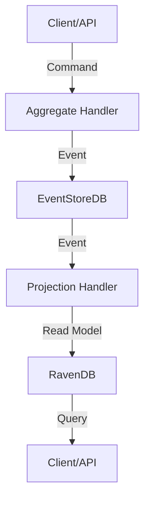

# 🚀 Rosetta Framework

**Domain-Driven Design, Event Sourcing, and Projections for .NET & F# — with RavenDB, EventStoreDB, and modern HostBuilder integration.**


---

## ✨ Overview

**Rosetta** is a powerful, opinionated framework for building robust, event-sourced, domain-driven microservices in .NET and F#. 

Levarage the power of **F# Discriminated Unions** inside Rosetta to create error-proof Domain Solutions!

It provides:

- 🧩 **Aggregate Roots** and **Domain Events** (DDD)
- ⚡ **Event Sourcing** with EventStoreDB
- 📊 **Projections** with RavenDB (NoSQL) and extensible stores
- 🏗️ **HostBuilder Extensions** for seamless DI and service registration
- 🛠️ **CQRS**-friendly patterns and handler abstractions
- 🧪 **Testability** and clean separation of concerns

---

## 📝 Note:

 - While **Rosetta** is opinionated in its choice of technologies, it is built to be easily extensible.
 - You can integrate any Event Sourcing backend or SQL/NoSQL database implementation with minimal effort, adapting the framework to your unique requirements and infrastructure.
 - Any additional implementations are very welcome and would contribute to the Framework's out-of-the-box usability!

## 📦 Features

- **Aggregate & Event Abstractions**: Write expressive, testable domain logic.
- **EventStoreDB Integration**: Reliable, scalable event storage.
- **RavenDB Projections**: Fast, flexible read models.
- **Plug-and-Play HostBuilder Extensions**: Register everything with a single line.
- **CQRS Handlers**: Command and event handler patterns out-of-the-box.
- **Idempotency & Consistency**: Built-in support for safe, repeatable operations.
- **Modern F# & C# Support**: Idiomatic, clean code for both languages.

---

## 🏗️ Architecture



---

## 🚦 Quick Start

### 1. Install NuGet Packages

```shell
dotnet add package SI.Rosetta.Aggregates
dotnet add package SI.Rosetta.Projections
dotnet add package EventStore.Client
dotnet add package RavenDB.Client
```

### 2. Register Aggregates & Projections

```fsharp
open SI.Rosetta.Aggregates.HostBuilder
open SI.Rosetta.Projections.HostBuilder

Host
  .CreateDefaultBuilder()
  .UseAggregatesWith<SI.Rosetta.HostBuilder.EventStore>(typeof<_Assembly_Containing_Aggregates_>.Assembly)
  .UseProjectionsWith<SI.Rosetta.HostBuilder.EventStore, SI.Rosetta.HostBuilder.RavenDB>(typeof<_Assembly_Containing_Projections_>.Assembly)
  .Build()
  .Run()
```

---

## 🧑‍💻 Example: Person Aggregate

### Domain Model

```fsharp
type PersonAggregate() =
    inherit Aggregate<PersonAggregateState, PersonCommands, PersonEvents>()
    override this.Execute(command) =
        match command with
        | Register cmd -> if this.State.Version > 0 then ... else this.Register cmd
        | ChangeName cmd -> ...
        | SetHeight cmd -> ...
```

### State

```fsharp
type PersonAggregateState() =
    inherit AggregateState<PersonEvents>()
    override this.ApplyEvent(ev) =
        match ev with
        | Registered e -> this.Id <- e.Id
        | NameChanged e -> this.Name <- e.Name
        | HeightSet e -> this.Height <- e.Height
```

### Handler

```fsharp
type PersonAggregateHandler(repo: IAggregateRepository) =
    inherit AggregateHandler<PersonAggregate, PersonCommands, PersonEvents>()
    override this.ExecuteAsync(command) =
        task {
            match command with
            | Register cmd -> do! this.IdempotentlyCreateAggregate cmd.Id command
            | ChangeName cmd | SetHeight cmd -> do! this.IdempotentlyUpdateAggregate cmd.Id command
        }
```

---

## 📊 Example: Person Projection

```fsharp
type PersonProjectionHandler(store: INoSqlStore) =
    interface IProjectionHandler<PersonEvents> with
        member this.Handle(event, checkpoint) =
            task {
                match event with
                | Registered e -> let person = { ... }; do! store.StoreAsync person
                | NameChanged e -> do! this.Project(e.Id, fun p -> { p with Name = e.Name })
                | HeightSet e -> do! this.Project(e.Id, fun p -> { p with Height = e.Height })
            }
```

---

## 🏆 Why Rosetta?

- **DDD-first**: Designed for rich, expressive domain models.
- **Event Sourcing**: Every state change is an event, not just a row update.
- **Projections**: Build fast, query-optimized read models.
- **Extensible**: Add your own aggregates, projections, and stores.
- **Modern .NET**: Async/await, DI, HostBuilder, and more.

---

## 🛡️ Best Practices

- Use **CQRS**: Separate command and query responsibilities.
- Keep **domain logic** in aggregates, not handlers or controllers.
- Use **FluentValidation** for input validation.
- Register all services via HostBuilder extensions.
- Write **unit tests** for aggregates and projections.

---

## 📚 Documentation

- [Event Sourcing Concepts](https://martinfowler.com/eaaDev/EventSourcing.html)
- [Domain-Driven Design](https://dddcommunity.org/)
- [RavenDB Docs](https://ravendb.net/docs/)
- [EventStoreDB Docs](https://developers.eventstore.com/)

---

## 🤝 Contributing

PRs, issues, and suggestions are welcome!  
Please follow the DDD and .NET conventions outlined in this repo.

---

## 📝 License

MIT License

---

## 💬 Questions?

Open an issue or start a discussion!

---

**Happy coding!** 🚀

---

Let me know if you want to tailor this further for your organization, add more advanced usage, or include badges for build/test status!
